# Wireshark profielen

Voor we verder gaan met het capteren van _packets_, gaan we eerst ons profiel wat bijwerken. We overlopen een paar optimalisaties, maar hou in het achterhoofd: we gaan protocollen analyseren, zelfs met een aantal visuele optimalisaties moeten we nog altijd weten wat een protocol onder normale omstandigheden doet, anders zullen we nooit weten wat abnormaal gedrag is. Daarvoor zijn slechts 2 manieren:

* Een aantal boeken over networking en tcp/ip achteroverslaan
* Veel oefenen met Wireshark

Deze _Wireshark 101_ handleiding is slechts een aanzet tot en is geen definitieve gids tot _Wireshark_.

## Wat zijn profielen?

Vermits er verschillende soorten data zijn \(web trafiek, voip trafiek, ...\) kan het nuttig zijn om verschillende profielen aan te maken, zodat je niet veel tijd verliest aan het optimaal klaarzetten van je instellingen.

Zo zal je rechts beneden zien welk profiel er op dit moment actief is. In mijn screenshot is dit het profiel **Test-profile**. Door op de naam te klikken, kan je snel wisselen van profiel.

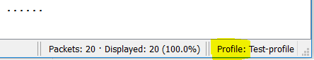

Door er met de rechtermuisknop op te klikken, kunnen we deze beheren.

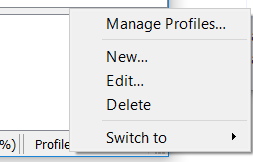

Via de _new_ of _manage profiles_ knop kan je een nieuw profiel aanmaken. Dit zal altijd vertrekken vanaf het basisoverzicht . Zelfs als je het _default profile_ aanpast. Dit is handig als je je _default profile_ te hard hebt aangepast zonder het te beseffen en terug naar iets minimalistisch wenst te gaan.

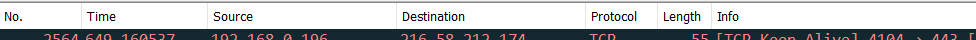

Wat er in je profiel terechtkomt, is heel uitgebreid. Wij gaan slechts de display filters en enkele van de \_preferences\_bekijken. Een volledige lijst vind je hier: [https://www.wireshark.org/docs/wsug\_html\_chunked/ChCustConfigProfilesSection.html](https://www.wireshark.org/docs/wsug_html_chunked/ChCustConfigProfilesSection.html) .

## Preferences

Onder preferences heb je een aantal weergave opties die al de moeite zijn om aan te passen. De _preferences_ optie vind je onder de _edit_ knop.

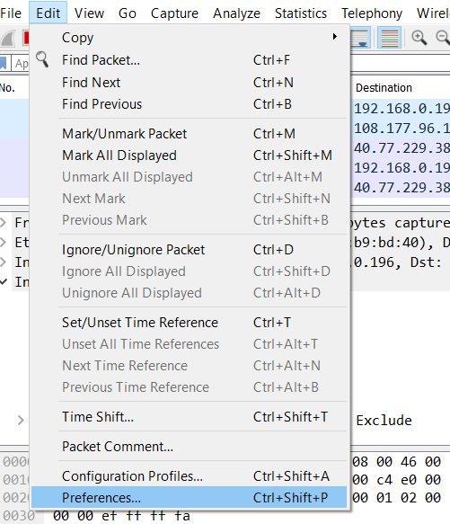

### Layout panes

Een strikt persoonlijke keuze, maar vermits we meestal meer interesse hebben in de instellingen van onze transport-, en netwerklaag is het misschien interessanter om de data wat meer opzij te schuiven en de 2de layout optie te kiezen. Probeer het!

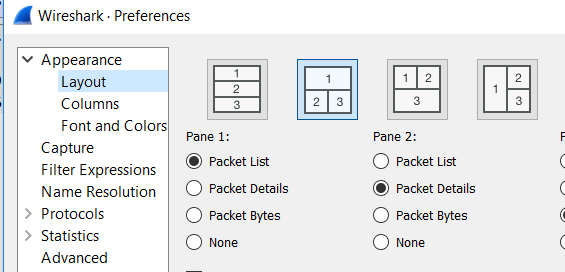

### Columns

Onze kolommen bevatten een schat aan informatie die we kunnen gebruiken om te sorteren, filteren en datastromen te volgen. Hier gaan we zeker een aantal opties toevoegen. Maar welke opties en wat zijn de namen van de velden? Daar zijn een paar handige trukjes voor. Hierover iets verder meer.

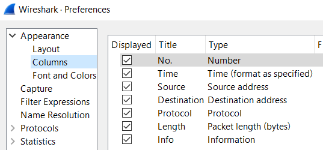

### Protocols

Recente versies zouden onderstaande Protocol-opties moeten afgevinkt hebben, het kan nooit kwaad om dit te verifiëren. De reden om deze af te vinken, vind je hier: [https://wiki.wireshark.org/CaptureSetup/Offloading?action=show&redirect=TCP\_checksum\_offload](https://wiki.wireshark.org/CaptureSetup/Offloading?action=show&redirect=TCP_checksum_offload)

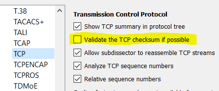

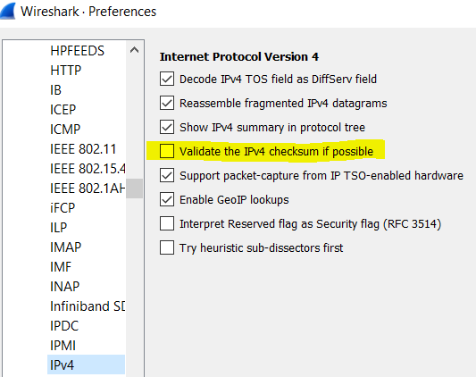

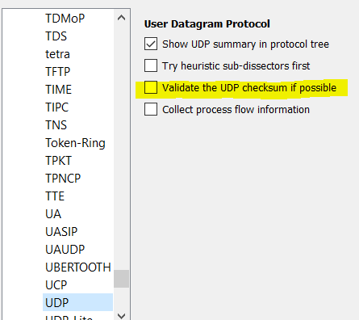

### Name Resolution

_Name Resolution_ kan ons enorm helpen maar het kan soms ook wel dingen vertragen.

* Resolve MAC adresses: Hij probeert meteen het mac-, en het ipadres te koppelen. Ook kijkt hij naar de OUI van het Mac adres en koppelt hij de juiste vendor aan de Mac.
* Resolve transport names: hij koppelt meteen de juiste service aan de poort \(vb: http aan 80\), dit kan een handige hulp zijn als je niet sterk bent in het herkennen van application ports. Het kan je ook op een vals spoor zetten als er intern in een bedrijf een custom poort wordt gebruikt.
* Resolve network \(IP\) addresses: Het koppelen van een naam aan een ip met DNS. Als je live captured kan dit wel extra DNS-queries veroorzaken en de capture vertragen of als je een grote, opgeslagen capture herbekijkt kan dit wel vertraging bezorgen in het scrollen doorheen de capture. U bent gewaarschuwd.
* OID resolution is een handige als je de MIB-bestanden hebt van de toestellen in je netwerk. Dit vertaalt meteen al die SNMP-berichten.

## Een column toevoegen, methode 1

Omdat het in het begin moeilijk is om zomaar kolommen toe te voegen, omdat we misschien de namen niet kennen, zien we eerst de makkelijke methode.

Capteer een aantal _packets_ en stop het capteren. Zorg dat je een tcp-segment hebt zodat we enkele tcp-opties kunnen bekijken.

Selecteer het tcp-packet

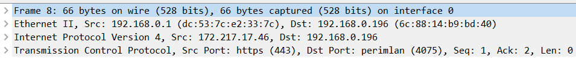

Open het frame onderdeel. Deze frame bevat heel wat informatie. Sommige ervan zijn velden die bestaan in de header, sommige velden zijn door Wireshark berekend om ons extra informatie te geven over de data die we zien.

Bijvoorbeeld: Hieronder heb ik de optie _Time delta from previous capture frame_ geselecteerd, dit is onbestaand in de header frame, het is door Wireshark berekend. Je kan deze Wireshark-velden herkennen omdat ze ingesloten zitten tussen rechte haakjes \[ \] .De informatie is op zich ook nuttig: standaard toont Wireshark enkel de tijd relatief tegenover het eerste _packet_ dat we gecaptured hebben. Het kan ook nuttig zijn om tijd tussen verschillende frames te zien, zodat we _delay_ in ons netwerk kunnen opsporen. Andere nuttige velden om in een kolom om te toveren zijn de _tcp acknowledgements \_en \_tcp sequence numbers \_en \_de bytes in flight_.

Door er rechts op te klikken, kunnen we dit veld wel als een kolom toevoegen om altijd de informatie zichtbaar te hebben.

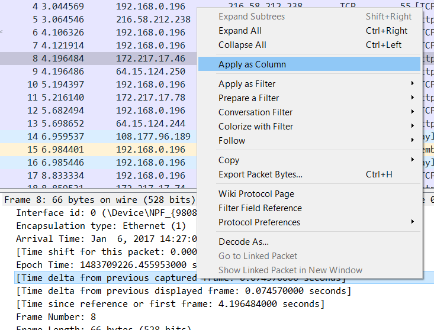

Voila, een extra kolom erbij

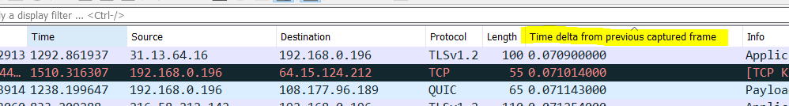

Onze extra kolom, wel een lange titel, die makkelijk aan te passen is door terug te keren naar de _columns_ sectie onder _preferences_.

## Een Column toevoegen, methode 2

Willen we toch columns toevoegen op basis van hun veldnaam, dan kunnen we deze veldnamen ook makkelijk achterhalen door links op de statusbar te kijken. In dit geval gaat het om het veld **frame.encap\_type**. 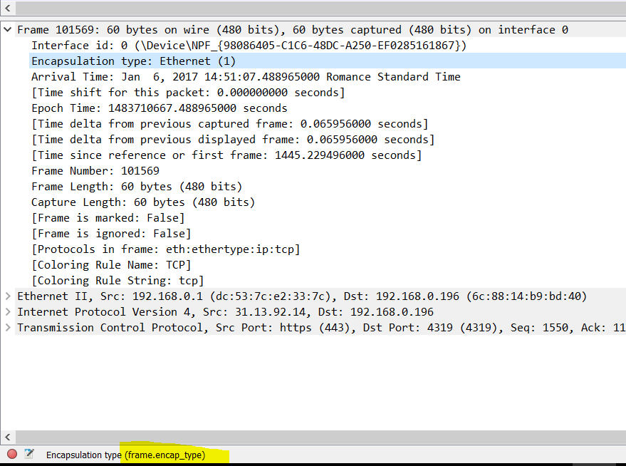

Dit veld voegen we toe aan onze _columns_ onder _preferences_ en zo hebben we een nieuwe kolom gemaakt. De _title_ kies je zelf, het _type_ is _custom_ en bij _field name_ vul je dan de naam in van het veld.

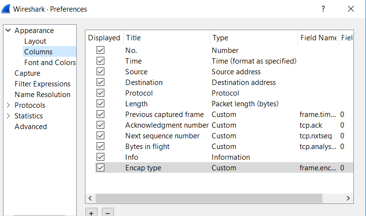

