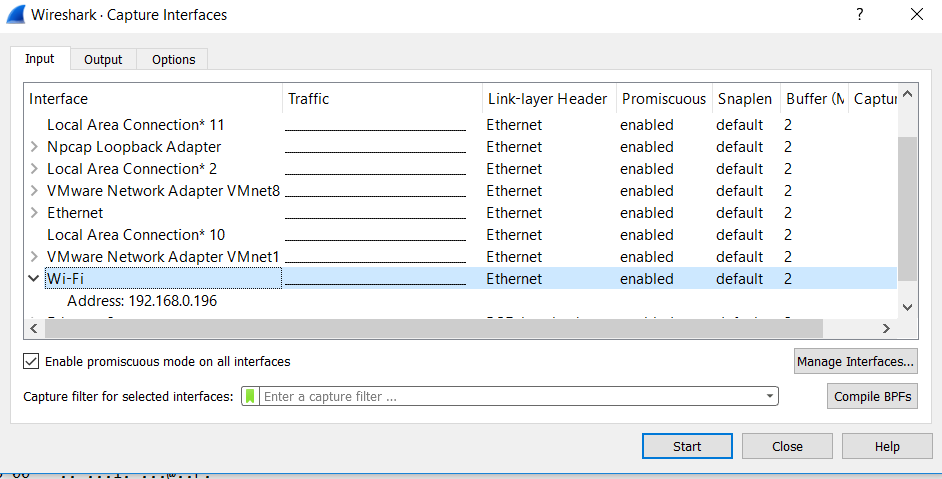
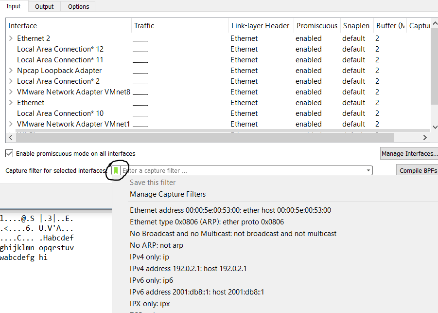
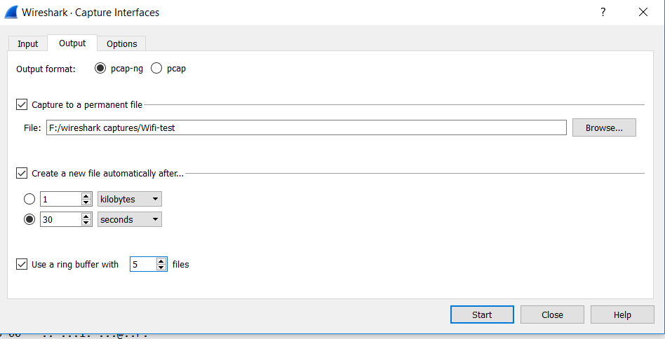
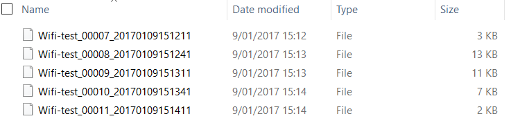
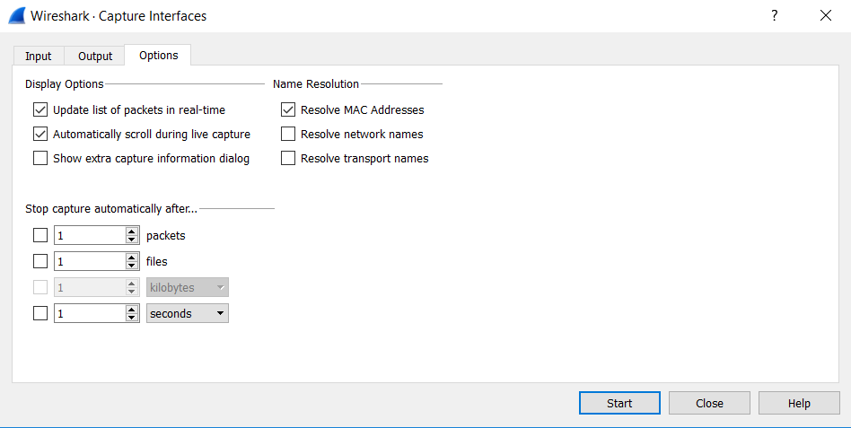

# Capture options

_Capture options_ gaat over de manier waarop we zaken gaan capteren. Belangrijk om weten: deze opties blijven actief zolang _Wireshark_ open blijft. Dit vergeten kan wel leiden tot enkele frustrerende momenten.

## Capture Input

Via _CTRL + K_ of via _capture_ en vervolgens _options_ menu komen we in de volgende schermen terecht. Naast het selecteren van onze netwerkkaart, kunnen we hier ook al selecteren welke _packets_ we willen filteren. Dit is **niet** hetzelfde als de _display filter_ \(komt later aan bod\). Deze filter zorgt er immers voor dat enkel bepaalde packets daadwerkelijk gecapteerd worden. De _display filter \_is een filter voor reeds gecapteerde \_packets_.

Door op het groene icoontje te klikken, kan je een aantal prefab filters aanspreken of er zelf nieuwe toevoegen. Je kan ook gewoon meteen je eigen filter typen op de _Enter a capture filter_ balk.

Door op voorhand te filteren kan je reeds ongewenste trafiek eruithalen en je capture file kleiner houden. Merk op: je kan zowel positief als negatief filteren. Dus je kan ervoor kiezen om:

* Te specifiëren welke data je capteert
* Te specifiëren welke data je niet capteert

## Capture Output

Moeilijke troubleshooting situaties zijn die waarbij een probleem slechts sporadisch optreed. Je zou wireshark gewoon kunnen laten draaien, maar dan wordt de capture file enorm groot en eventueel zelfs zo groot dat de harde schijf vol zit en de pc crashed. Daarom kan je kiezen om een maximum grootte in te stellen op een bestand of een maximum tijdsduur dat er moet gecapteerd worden.

Dankzij de _Ring Buffer_ kan je ook kiezen om de bestanden op te splitsen nadat ze hun tijdsduur of grootte hebben bereikt en deze zelfs laten roteren, zodat je altijd de meest recente data hebt.

In dit voorbeeld heb ik een ring buffer van 5 gekozen en elke 30 seconden een nieuw bestand laten creëeren.

 **Opmerking:**Zet gerust reeds _.cap_ als extentie, Wireshark zal netjes de bestandsnamen aanpassen en de _.cap_ extentie behouden.

Dit is het resultaat. Merk op dat de bestandsnamen ook aanduiden op welk tijdstip ze zijn aangemaakt.

## Capture Options

Hier zien we een aantal opties terug zoals het resolven van Mac adres en om de capture automatisch af te sluiten na een bepaalde tijdsduur.

