# De eerste capture analyseren

## Voorbereiding

We gaan een simpele eerste capture doen van het bezoek van een webpagina. Eerst zien we wat er allemaal mogelijk is en waar we rekening moeten mee houden bij het bekijken van een capture om vervolgens wat dieper op de capture zelf in te gaan.

Gelieve dus de volgende stappen mee te volgen om zo al een eerste keer te oefenen met _Wireshark_

Voer eerst de volgende commands uit op de commandline:

```text
ipconfig/flushdns
arp -d
```

Start je _Wireshark_ capture

Bezoek nu de website: [http://www.bob.be](http://www.bob.be) en stop de capture nadat de website ingeladen is, bewaar deze dan ook al voor de zekerheid. _CTRL + S_ of _File_ en vervolgens _save as_ .

De capture informatie die we nu hebben zal van vele factoren afhangen, zoals bv:

* Waar is er gecapteerd in het netwerk?
* Welke browser gebruiken we?

## De factoren

### Waar is er gecaptured geweest?

In dit geval kennen we de locatie van waar er gecaptured is. Maar hoe kunnen we dat nog achterhalen? Voor die momenten dat er een capture door een collega gebeurd is of je de capture enkele weken later herbekijkt.

Door het IP te resolven kan ik al zien dat mijn client de telenet DNS servers heeft aangesproken. 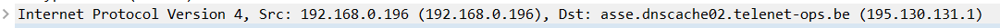

Door naar het Mac-adres te kijken kan ik zien dat het gesprek zich afspeelt tussen een _Intel \_NIC en een \_CompaLbr_ .

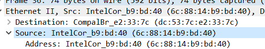

Een beetje zoekwerk en we komen uit op een firma die netwerkapparatuur maakt en oa de Docsis-modems die Telenet ook gebruikt: [http://www.icbn.com.tw/category1s/category1\_small\_lists\_en/category2\_id:3](http://www.icbn.com.tw/category1s/category1_small_lists_en/category2_id:3)

De TTL \(Time To Live\) verklapt ons ook al dat de capture gemaakt is op de client machine en niet op de server. Vermits de TTL 128 is, moet deze capture wel gebeurt zijn op het LAN-segment waar het packet begon.

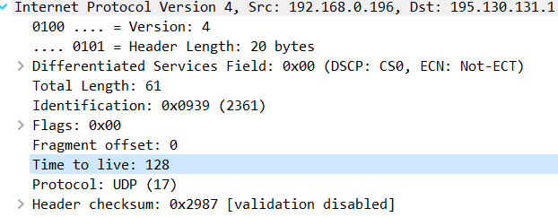

Voor een overzicht van gekende TTL's van Operating Systems: [http://subinsb.com/default-device-ttl-values](http://subinsb.com/default-device-ttl-values) .

Al deze bovenstaande informatie moet samen geëvalueerd worden, enkel aan de hand van de TTL kan je natuurlijk niet per sé alles zien. Tenzij je de TTL bekijkt van een Syn-packet, dan kan je al haast zeker zijn dat je goed zit.

### Welke browser gebruiken we?

Mijn computer zit tsjokvol software die zichzelf updaten wanneer ze de kans hebben of voor andere doeleinden netwerkverbindingen leggen. Als je eigen computer teveel ruis veroorzaakt, zal dat het capteren van data wat ingewikkelder maken.

Bijvoorbeeld: Hieronder het verschil tussen chrome en firefox.

Chrome is in dit geval uitgerust met tal van plugins en heeft toegang tot een door-en-voor google speciaal ontwikkeld protocol, QUIC, dat in werking treed zodra je Chrome begint te gebruiken. [https://www.chromium.org/quic](https://www.chromium.org/quic) . 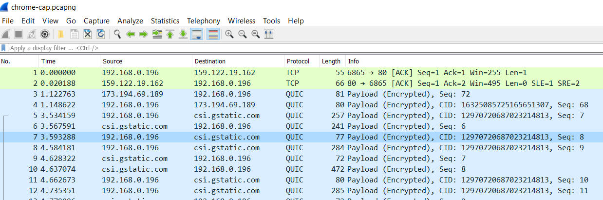

Deze Firefox is een verse installatie zonder addons of andere toevoegingen. Het verschil is meteen merkbaar: het binnenhalen van www.bob.be is zo goed als één van de eerste packetten die Wireshark toont \(na de dns query van het domein\) 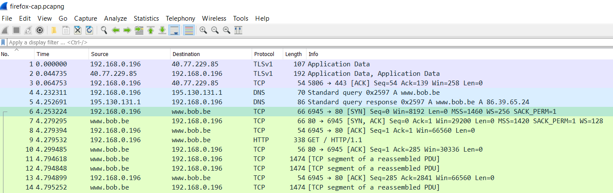

## De datastroom bekijken

### Display filters

Er passeert veel ruis aan onze netwerkkaart, dus zullen we van onze _display filters_ moeten gebruikmaken om snel de juiste data tevoorschijn te toveren.

_Display filters_ kunnen altijd aangepast worden naar wens en de mogelijkheden zijn legio.

Maar welke filter zouden we gebruiken als we onze traffiek tussen onze computer en de website www.bob.be willen analyseren?

We zouden kunnen filteren op het http protocol

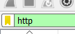

Of op tcp poort 80

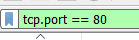

Of op destination port 80

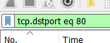

Een iets alternatieve schrijfwijze voor destination port 80

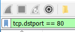

Ik wacht wel even tot je ze zelf allemaal hebt geprobeerd.

...

...

...

Ok, dat gaf verschillende resultaten weer, niet waar?

* Filteren op enkel http geeft ons enkel de data van de website, zonder onze tcp-packetten met onze handshake en acks.
* Filteren op poort 80 geeft ons wel al die informatie.
* De alternatieve schrijfwijze geeft ons gewoon hetzelfde als het vorig punt.

### Met wat moeten we dan filteren?

De algemene tcp poort 80 filter is niet slecht en snel gemaakt, maar geeft ons ook potentieel informatie over andere connecties, dus meer ruis.

Bij twijfel kan je altijd zoeken naar het begin van de conversatie tussen 2 pc's. De TCP- handshake is daarvoor de uitgelezen plek of misschien de http GET-request ? Probeer het zelf.

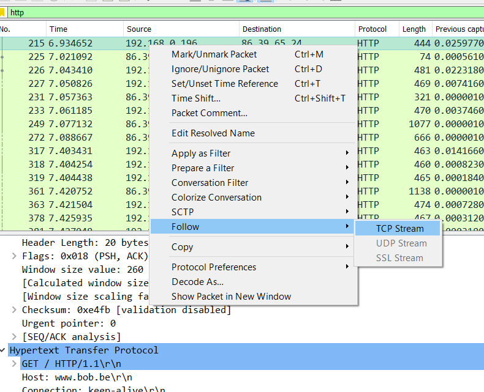 Vervolgens krijg je een venster met iets soortgelijks te zien: 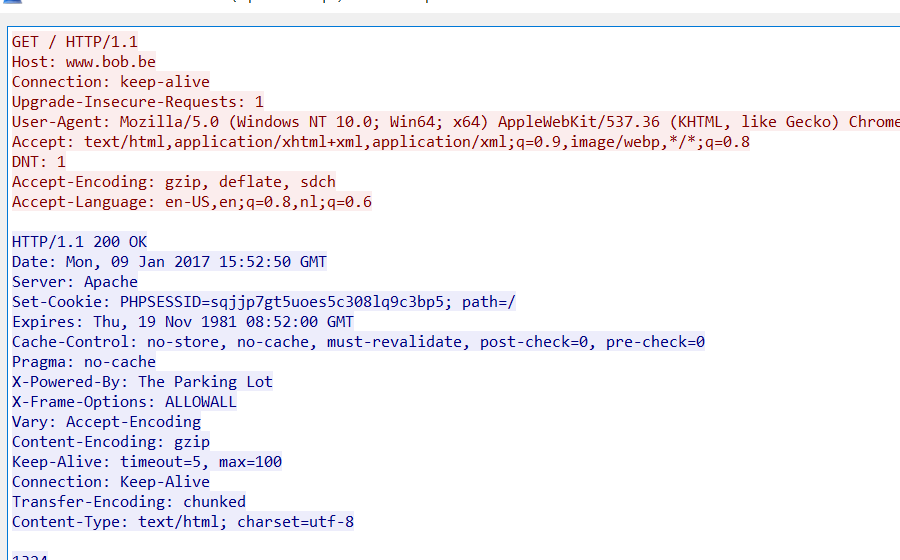 Je kan gewoon op _close_ klikken en voila, _Wireshark_ heeft zelf een filter aangemaakt. 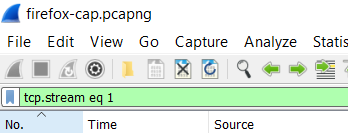

Deze filter is uniek aan de trace, dus die kan je niet zomaar overnemenin andere traces.

Hiermee hebben we dan eindelijk onze filter die we nodig hebben... of toch niet?

### Helaas, het filteren is nog niet gedaan

Het lijkt erop dat we alles hebben kunnen filteren van ons bezoek aan de website, maar niets is minder waar. De optie _conversations_ zal dat snel duidelijk maken.

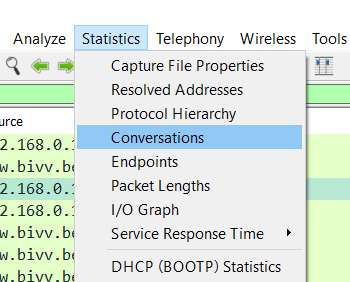

Er zijn meerdere tcp-conversaties

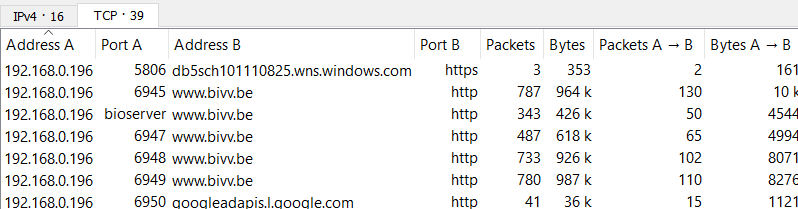

Ofwel gaan we dus alle tcp streams moeten achterhalen en een filter maken met met de operator "or"

`tcp.stream eq 1 or tcp.stream eq 2 or tcp.stream eq 3`

of we houden het simpelweg op een filter gebaseerd op source en destination IP-adres. Zoals in het voorbeeld hieronder.

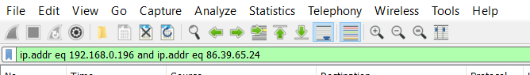

`ip.addr eq 192.168.0.196 and ip.addr eq 86.39.65.24`

### Display filter "oeps"

We hadden ook kunnen filteren op bijvoorbeeld destination IP-adres \(zelfde resultaat als destination tcp port 80\) maar die lijkt niet te werken? 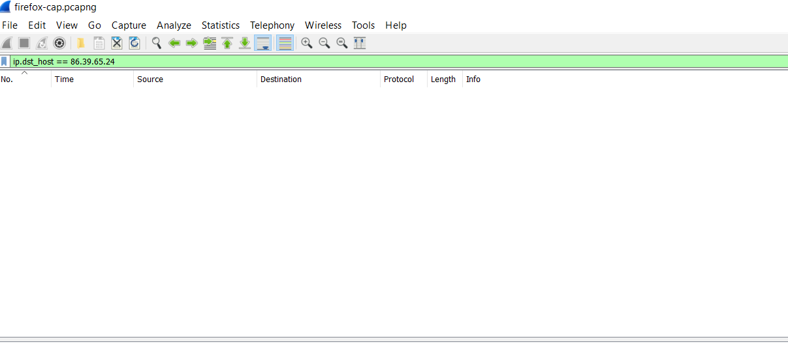 Of toch wel! 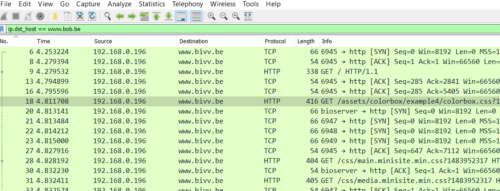

Eenmaal de _name resolution_ functie is ingeschakeld, kan je blijkbaar niet altijd meer IP-adres gebruiken, maar moet je de hostname gebruiken in combinatie met _ip.dst\_host_.

## Visuele hulp

Sinds een van hun 2.x versies hebben de Wireshark ontwikkelaars een aantal visuele hulpmiddelen toegevoegd aan hun programma. Kleine onopvallende zaken die een schat aan informatie bevatten

### De No. kolom

Deze kolom bevat niet enkel het nummer van een frame, maar ook een aantal markeringen waar je snel kan overkijken. Zo zal bij het selecteren van een _TCP 3-way handshake_, Wireshark je aanduiden tot waar deze sessie loopt.

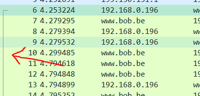

Dat is niet alles, zoek in je trace waar je een _GET / HTTP/1.1 http-packet_ hebt.

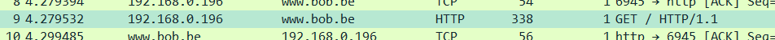

Hierbij zal Wireshark je zeggen waar, op applicatieniveau, de client en de webserver met elkaar communiceren en antwoorden komen op _GET \_en waar een nieuwe \_GET_ start. 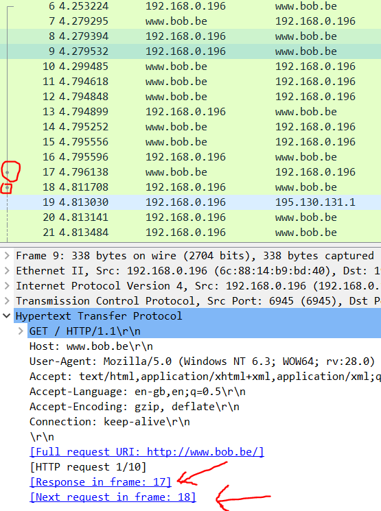

Dat is niet alles, bij een DNS-request zal hij ook aanduiden waar het antwoord op die request is. Bij een snelle verbinding is dat meestal de volgende lijn, zoals in deze foto. Dus dat valt wel mee.

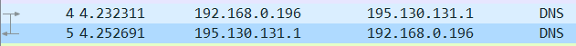

Bij het opvolgen van ACKs geeft hij ook een visuele markering. In deze screenshot heb ik _frame 24_ aangeduid, dat een ACK is op de data van _frame 18_

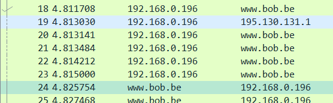

### De scrollbar

Een andere toevoeging is de scrollbar waarop je kan zien waar er zich slechte frames bevinden. Heel handig bij grote capture-bestanden. Als je natuurlijk een zorgeloze capture in je handen hebt, zal je deze markeringen niet hebben.

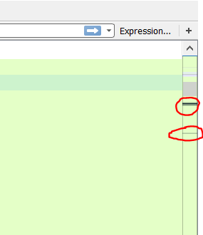

Als ik naar de dikke zwarte lijn scroll, kom ik uit bij een aantal zwarte frames, dit zou kunnen duiden op een probleem.

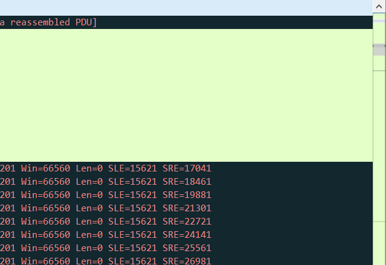

