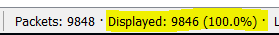
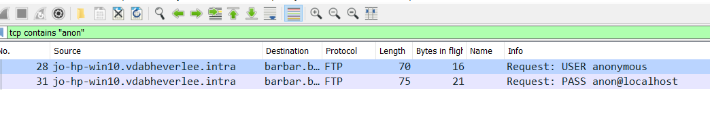

# Display Filters

Zoals uit de eerste capture misschien al gebleken is, gaan display filters een groot deel van het werk uitmaken om ruis weg te filteren, we willen immers met nuttige data overblijven. Hieronder bekijken we hoe display filters kunnen opgemaakt worden.

## Operators

Operators laten ons toe om verschillende display filters aan elkaar te koppelen. Zo kunnen we een redelijk uitgebreide filter maken en zodoende enkel zien wat we willen zien.

| English | C-like | Description and example |
| :--- | :--- | :--- |
| eq | == | Equal. ip.src==10.0.0.5 |
| ne | != | Not equal. ip.src!=10.0.0.5 |
| gt | &gt; | Greater than. frame.len &gt; 10 |
| lt | &lt; | Less than. frame.len &lt; 128 |
| ge | &gt;= | Greater than or equal to. frame.len ge 0x100 |
| le | &lt;= | Less than or equal to. frame.len &lt;= 0x20 |
| contains |  | Protocol, field or slice contains a value. sip.To contains "a1762" |
| matches | ~ | Protocol or text field match Perl regualar expression. http.host matches "acme.\(org\|com\|net\)" |
| bitwise\_and | & | Compare bit field value. tcp.flags & 0x02 |

De oorspronkelijke lijst kan je hier terugvinden: [https://www.wireshark.org/docs/wsug\_html\_chunked/ChWorkBuildDisplayFilterSection.html](https://www.wireshark.org/docs/wsug_html_chunked/ChWorkBuildDisplayFilterSection.html)

## In de praktijk: not so smooth operator

Laten we even zien hoe zo'n filter in de praktijk werkt. Samen met de obligatoire valstrik. Mijn eerste filter zegt: "Ik wil geen arp pakketten zien."

Gevolg: 2 pakketten worden niet getoond. Wat juist is \(geloof me nu maar\).

Je 2de filter zegt: "Ik wil geen arp of geen ssl pakketten zien."

Wacht, alle pakketten worden getoond?

Vreemd, wat als we zeggen "ik wil arp of ssl pakketten zien."

Dat zijn er 1416. Dat lijkt normaal.

Eigenlijk was onze filter oorspronkelijk fout, door te zeggen "of geen arp of geen ssl" hebben we eigenlijk niet gefilterd, omdat dit aanzien wordt als 2 aparte statements, waardoor je toch alles ziet.

Om te bekomen wat we eigenlijk willen, moeten we de statement aldus schrijven:

En dit komt wel overeen met die 1416 pakketten. 9848 - 1416 = 8432

Misschien om het iets minder verwarrend te maken is het best om de _and_ statement te gebruiken. "Ik wil geen arp pakketten zien en ik wil geen ssl pakketten zien."

Dat lijkt er al meer op.

## Contains

Contains is een leuke. Bijvoorbeeld als je door een hele resem ftp-verbindingen een bepalde username wenst terug te vinden.

