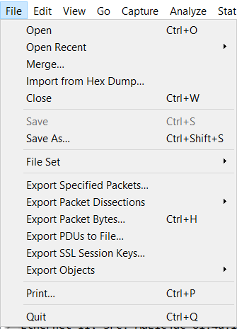
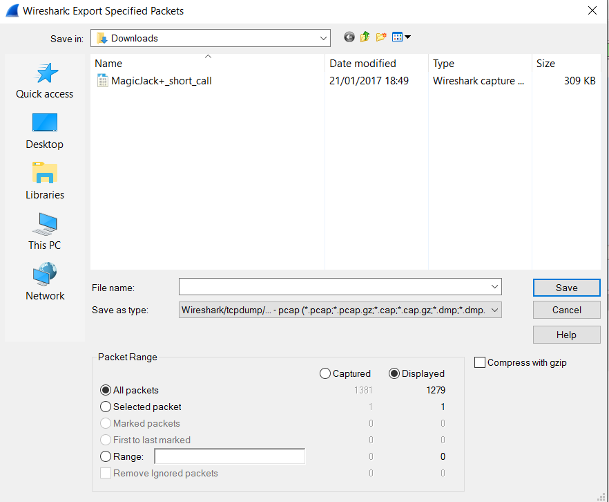

# Een capture bewaren

Captures analyseren is niet makkelijk en een netwerkprobleem kan al snel jouw kennis overstijgen. Misschien kan je dan de hulp inroepen van de leverancier van het netwerkmateriaal, zonder dat deze de hele binnekant van jouw netwerk kan achterhalen.

## Export specified

Via _Export Specified Packets_ heb je een aantal opties

Nadat een goede filter is ingesteld kan je door _displayed packets_ te selecteren enkel de packets doorsturen die van belang zijn, zo haal je zowel ruis als gevoelige informatie eruit. 

