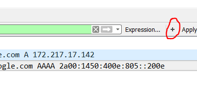
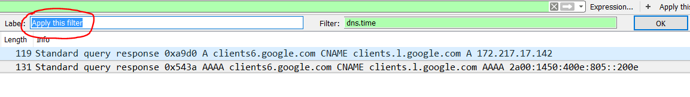
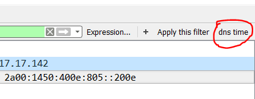

# Filters als knoppen

Sommige filters ga je vaak nodig hebben of zijn redelijk lang en ingewikkeld om telkens opnieuw van 0 te schrijven. Maak er dan een permanente knop van. Deze zijn tevens profielgebonden.

Stel de filter in die je wenst en druk op de "+" knop.

Kies welk _label_ je wenst te hebben voor je nieuwe knop. De \_filter \_wordt normaal automatisch overgenomen. Klik vervolgens op "OK".

Zie daar, je filterknop is erbijgekomen.

