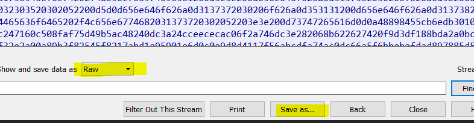

# Ftp file transfer onderscheppen

Door de google drives en dropboxen van deze wereld, zien we het FTP-protocol meer en meer naar de achtergrond verdwijnen. Dit wil echter niet zeggen dat het er niet meer is:

* Heel makkelijk te configureren
* Elke browser kan ook het ftp-protocol aan
* Makkelijk voor een snelle, kleine transfer

Maar het is ook makkelijk om deze data te onderschappen. Alweer een reden om voor SFTP te gaan.

In je Wireshark is het een kwestie van naar de juiste plek te gaan en eventuele ruis weg te filteren. FTP laat makkelijk zien waar file transfers beginnen dankzij de FTP-DATA stream en omdat je file requests gewoon in _clear text_ ziet.

Op het juiste moment een _Follow tcp-stream_ instellen.

Toch even nakijken om te zien of je aan het begin van het bestand ziet. PDF-bestanden beginnen met %PDF \(voor andere types moet je de volgende link even bekijken: [https://www.wikiwand.com/en/List\_of\_file\_signatures](https://www.wikiwand.com/en/List_of_file_signatures)\). Er bestaat ook een cool tooltje om het bestandstype te halen uit een onbekend bestand: [http://mark0.net/soft-trid-e.html](http://mark0.net/soft-trid-e.html).

Er toch opletten dat je niet als \_ASCII \_maar als \_RAW \_exporteert.

En een klik op de _save as_ knop later, heb je een leesbaar bestand op je harde schijf staan.

