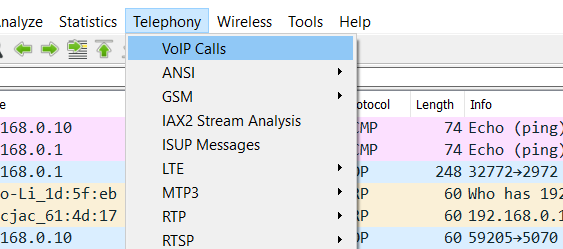
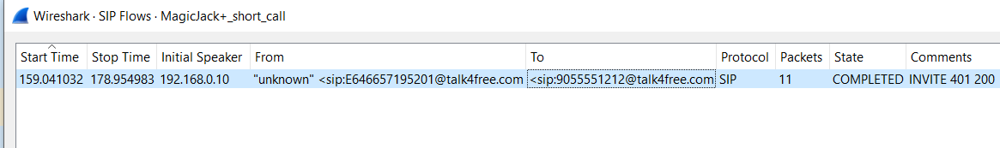
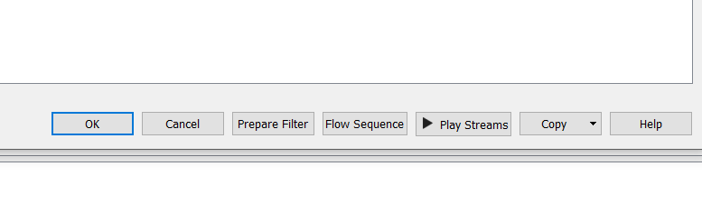
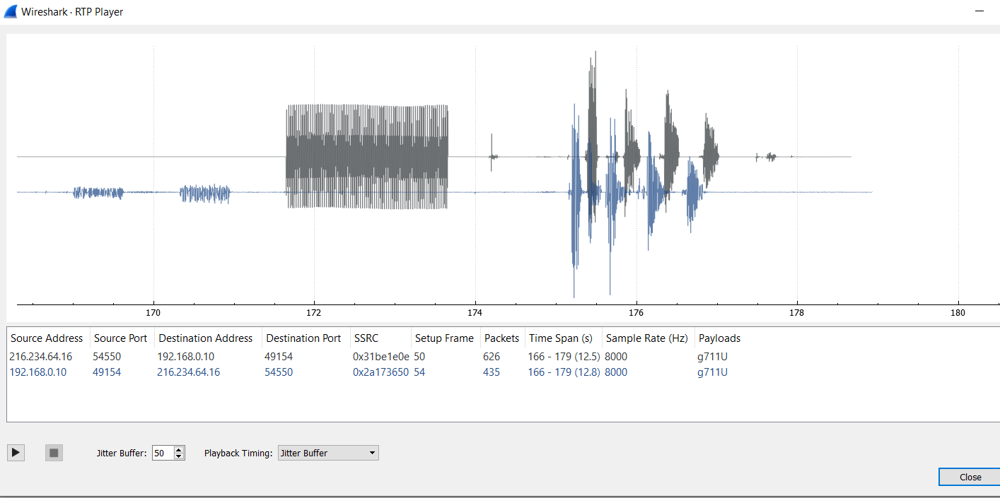
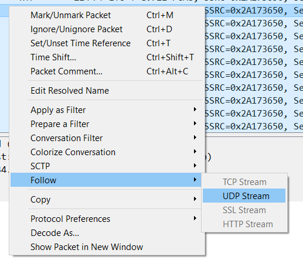
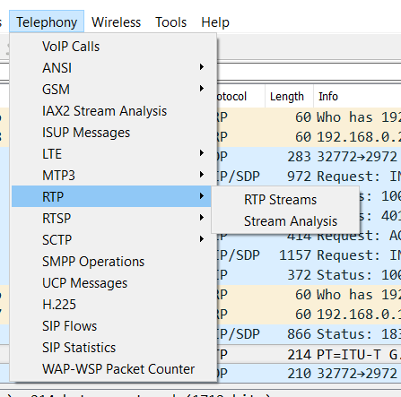
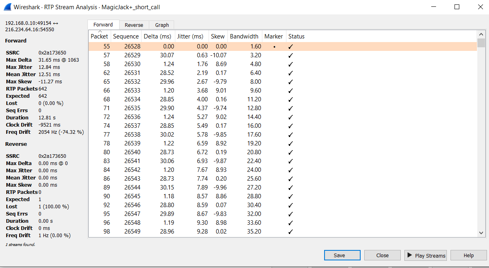
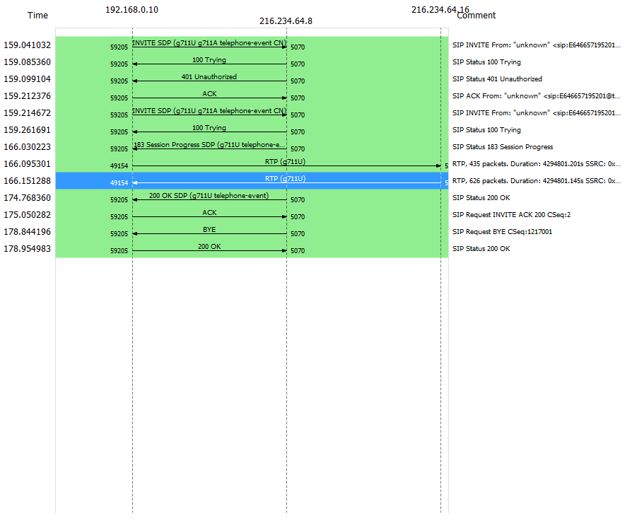

# Voip conversatie herbeluisteren

Een ongeëncrypteerde conversatie kan zonder al teveel moeite terug afgespeeld worden, Wireshark kan dit standaard al doen.

## Voorbereiding

Laat wireshark capteren tijdens het bellen of gebruik een sample capture van [https://wiki.wireshark.org/SampleCaptures\#SIP\_and\_RTP](https://wiki.wireshark.org/SampleCaptures#SIP_and_RTP) Ik gebruik deze: _MagicJack+ short test call A complete telephone call example_.

## Een call herbeluisteren

Heel veel moeite hoef je niet te doen om een _call_ te herbeluisteren. Via _Voip Calls_

en vervolgens via play stream

Als je nu op de play knop drukt, ga je de conversaties in beide richtingen horen

Is dit te storend, dan kan je wel in 1 richting de call herbeluisteren, maar dan moet je eerst een filter instellen, afhankelijk van de richting die je wenst te beluisteren.

Of via de _RTP streams_ optie gaan

Een stream kiezen en deze analyseren, zo bekom je ook nog eeens heel veel informatie over de stream.

Wil je heel snel een overzicht van een VOIP call hebben, dan kan je makkelijk een grafiek creëeren met de _flow sequence_ optie, die ook onder de _Voip calls_ optie zit.

