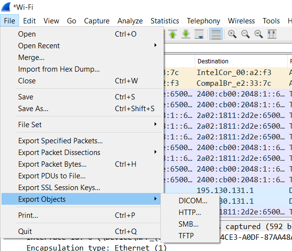
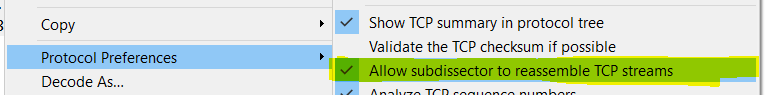

# Websites uit captures exporteren

## 2 klikken verder...

HTTP-inhoud kan je makkelijk exporteren, althans voor zover je nog http trafiek tegenkomt. Browsers en websites schakelen tegenwoordig standaard over naar https.

**Belangrijk**. Deze optie moet wel aangevinkt zijn, anders zal het niet lukken

