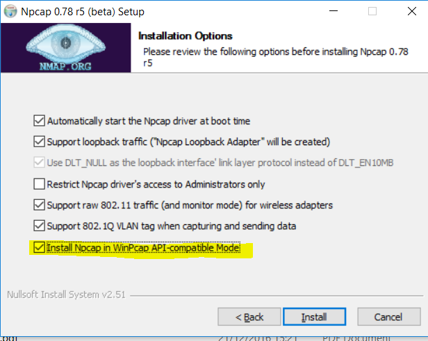
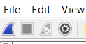
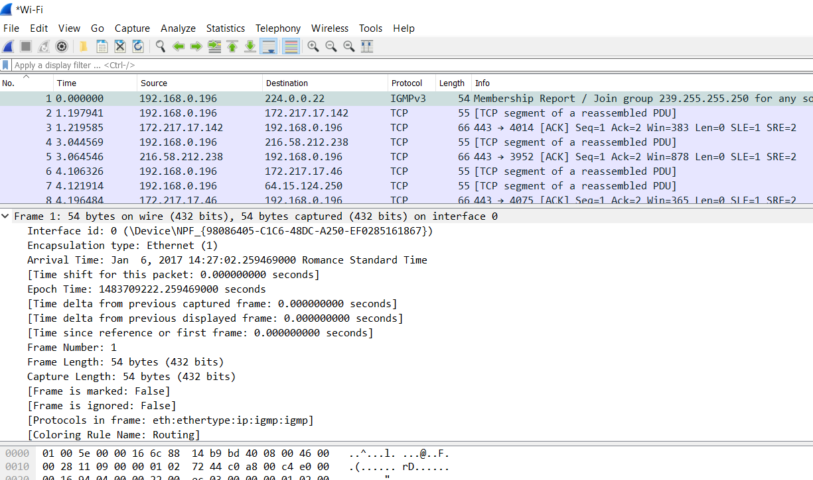

# Wireshark voor de eerste keer opstarten

De installatie van wireshark is een N-N-F installatie en heeft weinig om handen, zorg wel dat je de winpcap driver mee installeert. Indien je Nmap reeds hebt geïnstalleerd, met de Npcap driver, is het mogelijk dat de Winpcap-driver je komt vragen of je deze wil vervangen \(omgekeerd: Nmap na Wireshark ook\). De Npcap driver is op moment van schrijven superieur aan de Winpcap, maar controleer zeker altijd eerst zelf \([https://wiki.wireshark.org/NPcap](https://wiki.wireshark.org/NPcap)\).  
De Winpcap en Npcap driver kunnen naast elkaar leven, maar let dan wel op dat je Winpcap niet overschrijft.

Mocht je toch de Npcap driver willen gebruiken, vergeet hem dan ook niet in te stellen als vervanger voor Winpcap bij installatie van de Npcap driver.

Wireshark heeft recent een cosmetische update ondergaan, momenteel ziet het scherm er bij de opstart er zo uit:

Merk op: adapters van Hypervisors zijn ook aanwezig, dus we kunnen perfect een labo opzetten en hierop capteren.

Vervolgens is het een kwestie van een adapter te selecteren waarop je wil capturen en deze te dubbelklikken of op de blauwe haaienvin te klikken.

En de packetjes komen binnen...

