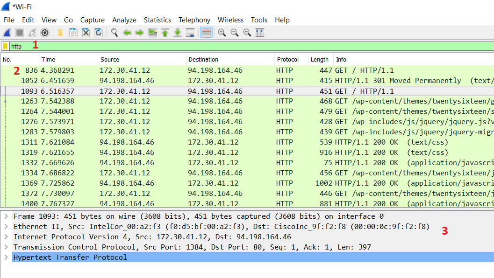
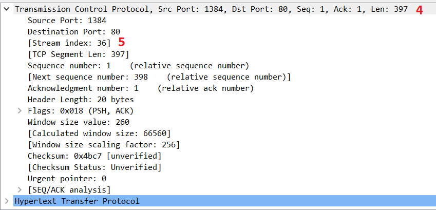

# Visueel overzicht van een capteersessie

Hier is reeds een kort overzicht van de verschillende elementen die zichtbaar zijn bij het opstarten van een Wireshark-sessie. Meer informatie volgt later, tijdens onze analyses.

1. Display Filter: Hier kan je een display filter zetten om de voorbijstromende packets te filteren. Ik filter op het http protocol, de groene achtergrond geeft aan dat ik een geldige filter gebruik. Een slechte of onvolledige filter wordt rood gekleurd en indien de filter ambigu kan geïnterpreteerd worden door het programma, kleurt het geel.
2. Hier laat Wireshark de individuele frames zien, in dit geval filter ik op het http-protocol, dus laat hij enkel frames zien die het http-protocol bevatten.
3. Deze verschillende _dissectors_ delen een frame in volgens de _TCP/IP protocol suite_ \(IPX etc... worden ook ondersteunt\). Wireshark kan dit doen dankzij ingebouwde regels. Om het kort te houden: het is mogelijk dat er hele specifieke protocols zijn, die Wireshark niet kent, deze zullen dan ook niet zo mooi worden onderverdeeld in _dissectors_ en _subdissectors_. Je kan mits plugins of een _dissector rule_ te schrijven deze wel alsnog toevoegen. Het is ook mogelijk dat men een applicatie niet op de standaard poort draait \(bv: een webserver op poort 8000\). In dat geval zal je de http-dissector moeten wijzigen zodat hij ook met poort 8000 rekening houdt.
4. Hier is de transport-laag opengeklikt van een frame met http inhoud. Alle inhoud van de transport-laag is dan zichtbaar.
5. Wireshark voegt intelligente, extra informatie toe. Velden die geen onderdeel uitmaken van het oorspronkelijk _packet_. Deze velden zijn makkelijk te onderscheiden omdat ze omgeven zijn door vierkante haakjes.

   

